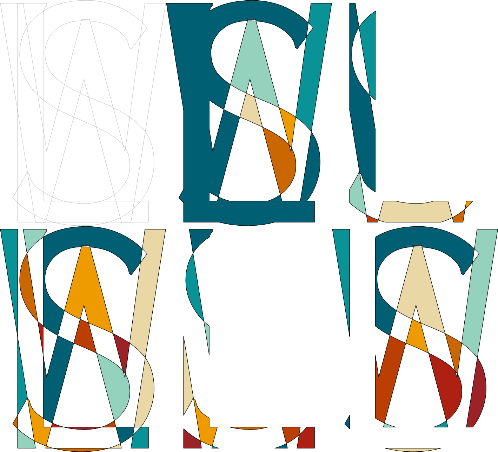

# linesweeper: a robust sweep-line algorithm

[](https://github.com/jneem/linesweeper/actions)
[](https://crates.io/crates/linesweeper)
[](https://docs.rs/linesweeper)

This rust crate implements a "robust" version of the Bentley-Ottmann sweep-line
algorithm, and uses it to provide various two-dimensional geometric primitives
like boolean operations on sets bounded by Bézier paths.
It is currently in an alpha state.



## Basic usage

To compute binary operations between curves, use the `binary_op` function, which
takes in two paths and computes some binary operation on them:

```rust
use kurbo::Shape;
use linesweeper::{binary_op, FillRule, BinaryOp};

let square = kurbo::Rect::from_center_size((0.0, 0.0), (2.0, 2.0)).to_path(1e-6);
let circle = kurbo::Circle::new((0.0, 0.0), 1.2).to_path(1e-6);
binary_op(&square, &circle, FillRule::EvenOdd, BinaryOp::Intersection);
```

## Advanced usage

For more advanced usage (like custom n-ary operations) see `Topology`, or
the example in `examples/bus.rs`.
